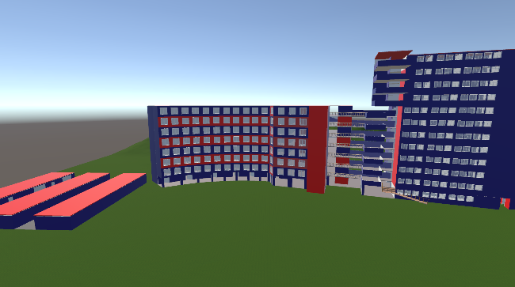
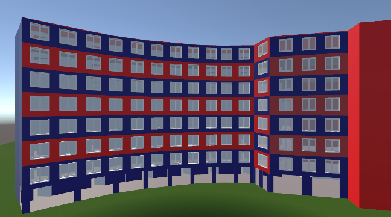
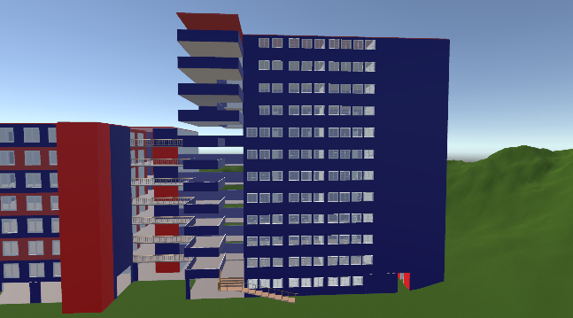
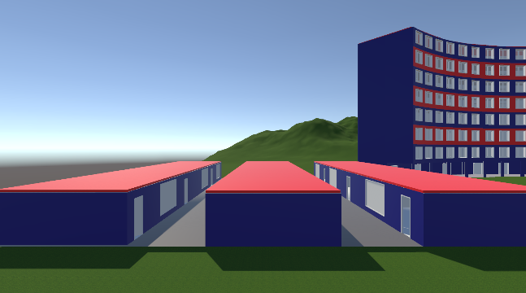
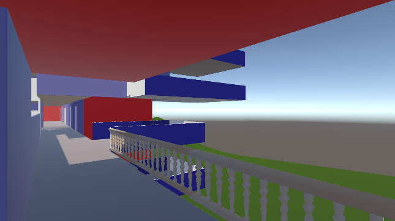

# UCV Infraestructura 3D - Unity

Proyecto académico desarrollado en Unity que representa la infraestructura de la **Universidad César Vallejo** en 3D.  
Incluye diferentes cámaras para visualizar pabellones (A, B, C) y una vista panorámica completa.

## 🏫 Descripción
- Modelado de infraestructura en **Sweet Home 3D** y exportación en formato `.obj`.
- Importación a Unity con aplicación de materiales, colores y terreno usando **assets de Unity**.
- Implementación de un sistema de cámaras para recorrer la infraestructura:
  - **0** → Vista panorámica
  - **1** → Pabellón A
  - **2** → Pabellón B
  - **3** → Pabellón C
  - **4** → Vista interna (cámara dentro del edificio)

## 🛠️ Tecnologías utilizadas
- Sweet Home 3D (modelado de infraestructura)
- Unity
- C# (script de control de cámaras)
- Assets de Unity para terreno

## 📂 Código del proyecto  
🔹 Script principal para el cambio de cámaras: [CambiarCamara.cs](scripts/CambiarCamara.cs)  

## 📸 Capturas de pantalla

## 🎥 Demo en video
👉 Mira el recorrido aquí: [Video en YouTube](https://youtu.be/eDFU0KUwVFA)

## 👩‍💻 Autor
Proyecto académico realizado por **Sandra Cabrera Avila**.

